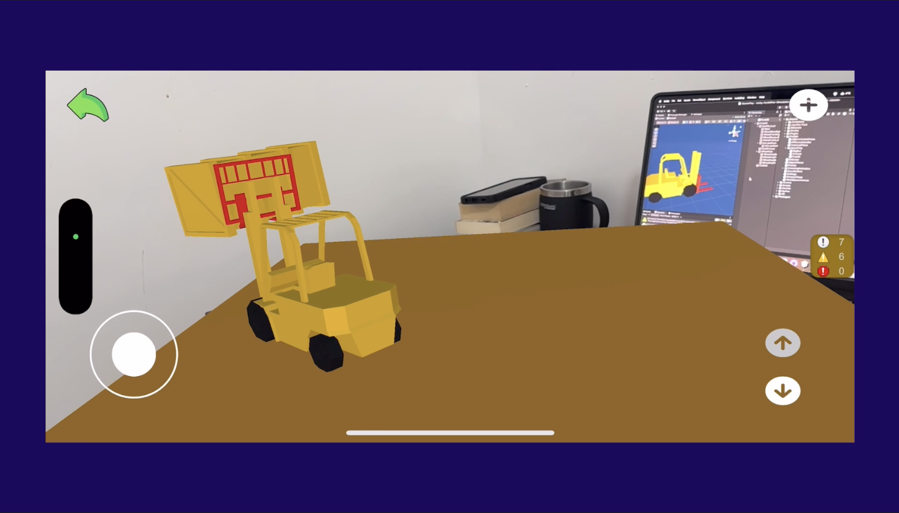

# AR Forklift Controller

An Augmented Reality (AR) game featuring a forklift controller with up/down movement controls.

## Features
- AR-based forklift control
- Realistic up/down movement simulation
- Intuitive joystick-based controls
- Industrial-themed assets and UI
- Short audio loops for immersive experience

## Assets and Resources
The following assets were used in this project:
- **AR Foundation**: [Unity AR Foundation 6.0](https://docs.unity3d.com/Packages/com.unity.xr.arfoundation@6.0/manual/index.html)
- **Unity XR**: [Unity XR Plugin](https://docs.unity3d.com/Packages/com.unity.xr.management@4.0/manual/index.html) - Used for managing XR devices.
- **Industry Models**: [Unity Asset Store - Industry](https://assetstore.unity.com/search#q=industry&nf-ec_price_filter=0...0)
- **Sound Effects**: [Pixabay Free Sound Effects](https://pixabay.com/sound-effects/search/loop/?duration=0-30)
- **UI Elements**: [Violet Themed UI](https://assetstore.unity.com/packages/2d/gui/violet-themed-ui-235559)
- **3D Models**: [TurboSquid Low Poly Vehicles & Props](https://www.turbosquid.com/3d-models/low-poly-vehicles-props-1576852)
- **Icons**: [Flaticon World Icons](https://www.flaticon.com/search?word=world)
- **Joystick Controls**: [Joystick Pack](https://assetstore.unity.com/packages/tools/input-management/joystick-pack-107631)

## Controls
- **Joystick**: Move the forklift
- **Up/Down Button**: Control forklift elevation

## Issues Faced
1. **Scaling the AR Object**: Encountered challenges in scaling the forklift correctly within the AR environment to maintain proportionality when viewed through different devices.
2. **Instantiating Player Inside the Platform**: Struggled with ensuring that the player character instantiated inside the platform aligned correctly with the ground or surface to avoid clipping issues.
3. **Forklift Update Method Delay**: Managed to resolve the delay in the forklift's movement by adjusting the Update method, ensuring smoother and more responsive controls.
4. **Car Controller and Unit Testing**: Developing a car controller for the forklift proved difficult, especially with unit testing, as accurately simulating physics and controls in an AR environment added complexity to the process.

## Screenshots

## Scripts
Refer to the `Scripts/` folder for implementation details.

## Play the Game
Try the game on **Itch.io**: [Insert your itch.io link here]

## License
This project is open-source. Make sure to check individual asset licenses before distribution.

## Credits
Special thanks to the asset creators and platforms mentioned above for providing high-quality resources.
